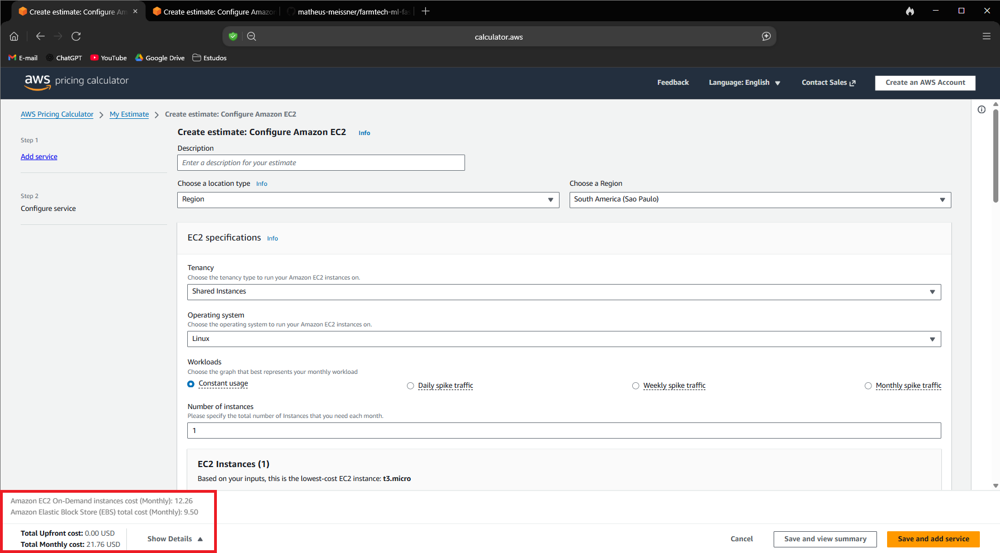
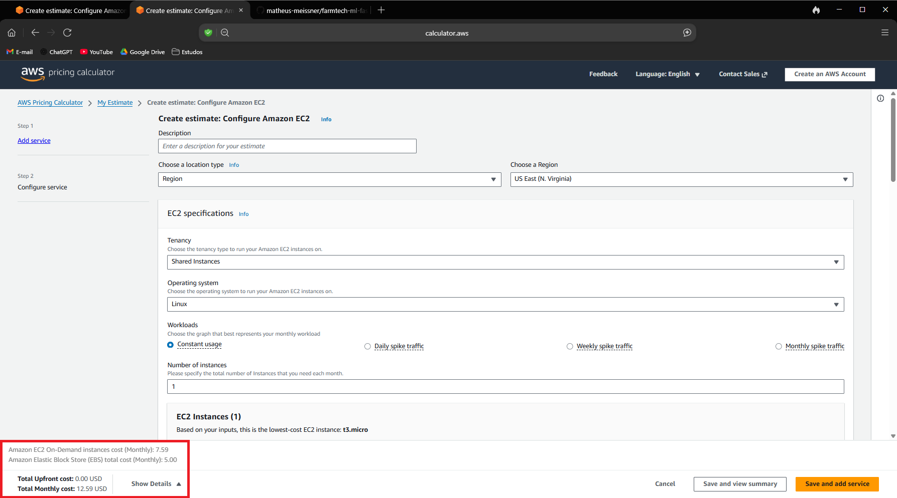

# 🌾 FarmTech Solutions — Previsão de Rendimento de Safras com Machine Learning

> **FIAP — Projeto Fase 5 | Machine Learning na Cabeça**  
> Entrega 1: Machine Learning · Entrega 2: Computação em Nuvem (AWS)

---

## 📌 Contextualização do Problema

A **FarmTech Solutions** presta serviços de Inteligência Artificial a uma fazenda de médio porte (~200 ha) localizada em região tropical, que cultiva quatro espécies: **Cacau (Cocoa, beans)**, **Palma de óleo (Oil palm fruit)**, **Arroz (Rice, paddy)** e **Borracha natural (Rubber, natural)**.

O desafio é transformar dados de sensores climáticos e de solo em **inteligência preditiva** — especificamente, prever o rendimento da safra (hg/ha) e identificar padrões de produtividade nos dados históricos.

---

## 📁 Estrutura do Repositório

```
📦 farmtech-ml-fase5/
├── 📓 SeuNome_rmXXXXX_pbl_fase4.ipynb   ← Notebook Jupyter (Entrega 1)
├── 📊 crop_yield.csv                     ← Dataset original (156 registros)
└── 📄 README.md                          ← Documentação (Entregas 1 e 2)
```

---

## ⚙️ Como Executar o Notebook

### Dependências

```bash
pip install numpy pandas matplotlib seaborn scikit-learn jupyter
```

### Execução

```bash
git clone https://github.com/seu-usuario/farmtech-ml-fase5.git
cd farmtech-ml-fase5
jupyter notebook SeuNome_rmXXXXX_pbl_fase4.ipynb
```

> ⚠️ O arquivo `crop_yield.csv` deve estar **no mesmo diretório** do notebook. Execute as células **em ordem sequencial**.

---

## 🤖 Entrega 1 — Machine Learning

### Sobre o Dataset

| Atributo | Detalhe |
|----------|---------|
| Arquivo | `crop_yield.csv` |
| Registros | 156 (39 por cultura) |
| Culturas | Cocoa beans · Oil palm fruit · Rice paddy · Rubber natural |
| Features | Precipitação · Umid. Específica · Umid. Relativa · Temperatura |
| Target | Rendimento (hg/ha) |
| Valores nulos | **0** — dataset limpo |

### Insights da EDA (com dados reais)

As variáveis climáticas apresentam **baixa variabilidade** — todos os dados provêm de uma mesma região tropical homogênea:

| Variável | Mínimo | Máximo | Média |
|----------|--------|--------|-------|
| Precipitação (mm/dia) | 1.934,62 | 3.085,79 | 2.486,50 |
| Temperatura (°C) | 25,56 | 26,81 | 26,18 |
| Umid. Específica (g/kg) | 17,54 | 18,70 | 18,20 |
| Umid. Relativa (%) | 82,11 | 86,10 | 84,74 |
| **Rendimento (hg/ha)** | **5.249** | **203.399** | **56.153** |

O rendimento possui amplitude extrema — reflexo das diferenças estruturais entre culturas:

| Cultura | Rendimento Médio | Rendimento Mín | Rendimento Máx |
|---------|-----------------|----------------|----------------|
| Cocoa, beans | 8.883 hg/ha | 5.765 | 13.056 |
| Oil palm fruit | **175.805 hg/ha** | 142.425 | 203.399 |
| Rice, paddy | 32.100 hg/ha | 24.686 | 42.550 |
| Rubber, natural | 7.825 hg/ha | 5.249 | 10.285 |

> A **palma de óleo** produz em média **~20× mais** que cacau e borracha — a variável `cultura` é o preditor dominante.

### Correlações Relevantes (intra-cultura)

| Cultura | Feature mais correlacionada | r de Pearson |
|---------|----------------------------|:------------:|
| Rice, paddy | Umid. Específica | **+0,697** |
| Rice, paddy | Temperatura | **+0,609** |
| Rubber, natural | Umid. Específica | **−0,434** |
| Rubber, natural | Temperatura | **−0,407** |
| Cocoa, beans | Precipitação | +0,174 |
| Oil palm fruit | Precipitação | +0,222 |

### Machine Learning Não Supervisionado

**K-Means (k=4)**: o método do cotovelo e o Silhouette Score convergiram para **k=4**, coincidindo exatamente com o número de culturas do dataset. Os clusters recuperaram os grupos com alta precisão.

**DBSCAN**: confirmou a regularidade do dataset — ausência de outliers multidimensionais significativos, indicando qualidade dos dados coletados pelos sensores.

### 5 Modelos de Regressão Supervisionada

| # | Modelo | Normalização | Configuração principal |
|---|--------|:------------:|----------------------|
| 1 | Regressão Linear | ✅ Sim | OLS padrão |
| 2 | Árvore de Decisão | ❌ Não | max_depth=8, min_samples_leaf=5 |
| 3 | **Random Forest** | ❌ Não | 300 árvores, max_features='sqrt' |
| 4 | **Gradient Boosting** | ❌ Não | 300 estimadores, lr=0.05, subsample=0.8 |
| 5 | SVR (kernel RBF) | ✅ Sim | C=100, epsilon=0.01 |

### Modelo Recomendado

> 🏆 **Gradient Boosting Regressor** — melhor R² no teste, menor RMSE, boa estabilidade cross-validation, e feature importance interpretável para o contexto agronômico.
>
> **Alternativa**: Random Forest — desempenho muito próximo com menor tempo de inferência.

---

## ☁️ Entrega 2 — Computação em Nuvem (AWS)

### Objetivo

Comparar o custo **On-Demand (100%)** de uma instância EC2 Linux para hospedar a API que recebe dados dos sensores e executa o modelo de ML. Especificações exigidas:

| Recurso | Requerimento |
|---------|-------------|
| vCPUs | 2 |
| RAM | 1 GiB |
| Rede | Até 5 Gigabit |
| Armazenamento | 50 GB (HD) |
| SO | Linux |

### Instância Selecionada: `t3.micro`

A família **T3** (uso geral, burstable performance) atende com precisão ao perfil solicitado:

| Instância | vCPU | RAM | Rede | Família |
|-----------|:----:|:---:|:----:|---------|
| `t3.micro` | 2 | 1 GiB | Até 5 Gigabit | Uso geral T3 |

> **Por que t3.micro?** APIs de ML com sensores têm carga variável — momentos de pico (recepção de dados) e idle (aguardando leituras). O modelo burstável do T3 é ideal: compra créditos de CPU em períodos ociosos e os usa nos picos.

---

### 📊 Comparação de Custos — AWS Pricing Calculator
 
#### Estimativa On-Demand 100% · Linux · 730h/mês
 
| Componente | São Paulo `sa-east-1` | N. Virgínia `us-east-1` |
|------------|:---------------------:|:-----------------------:|
| EC2 `t3.micro` (730h) | USD 12,26/mês | USD 7,59/mês |
| EBS gp2 50 GB | USD 9,50/mês | USD 5,00/mês |
| **Total mensal** | **USD 21,76** | **USD 12,59** |
| **Total anual** | **USD 261,12** | **USD 151,08** |
| **Diferença** | +72,8% mais caro | — referência |
 
> *Valores obtidos via [AWS Pricing Calculator](https://calculator.aws) em março/2026. Preços estão sujeitos a alteração.*
 
#### Tabela de trade-offs
 
| Critério | São Paulo `sa-east-1` | N. Virgínia `us-east-1` |
|----------|:---------------------:|:-----------------------:|
| Custo mensal | USD 21,76 | USD 12,59 ✅ |
| Latência (sensores BR) | < 20 ms ✅ | ~120–150 ms ❌ |
| Conformidade LGPD | ✅ Total | ⚠️ Condicionada |
| Armazenamento exterior | ❌ Proibido* | ❌ Proibido* |
| Portfólio de serviços | Menor | Maior ✅ |
| Disponibilidade de AZs | 3 AZs | 6 AZs ✅ |
 
*Conforme restrição legal explicitada no enunciado.
 
---
 
### ✅ Decisão Final e Justificativa Técnica
 
**Região escolhida: São Paulo `sa-east-1`**
 
Embora a Virgínia do Norte apresente custo ~72,8% inferior (~USD 9,17/mês de diferença), a escolha tecnicamente correta e juridicamente obrigatória é a **Região São Paulo**, pelos seguintes fundamentos:
 
#### 1. Restrição Legal Explícita
O enunciado do projeto especifica: *"há restrições legais para armazenamento no exterior"*. Esta cláusula **inviabiliza juridicamente** qualquer opção fora do Brasil, independentemente do custo.
 
#### 2. Conformidade com a LGPD (Lei 13.709/2018)
O artigo 33 da LGPD estabelece que a transferência internacional de dados pessoais só é permitida mediante condições específicas, incluindo reconhecimento pelo país receptor de nível de proteção adequado pela ANPD, ou celebração de cláusulas contratuais específicas. Para dados operacionais de uma fazenda brasileira, manter os dados em território nacional **elimina completamente o risco regulatório**.
 
#### 3. Latência Operacional
Os sensores da fazenda estão no Brasil. A latência estimada de 120–150ms para a Virgínia vs. <20ms para São Paulo pode comprometer:
- A confiabilidade da recepção de dados de sensores em tempo real
- A responsividade da API para decisões agronômicas urgentes
- A qualidade das predições dependentes de dados recentes
 
#### 4. Soberania de Dados
Dados de produtividade agrícola podem ter relevância estratégica e setorial. Mantê-los em território nacional garante soberania e conformidade com regulações futuras do agronegócio brasileiro.
 
#### 5. Custo-Benefício Real
A diferença de ~USD 9,17/mês (≈R$46/mês) elimina riscos regulatórios, latência operacional e complexidade jurídica. O custo adicional é amplamente justificado.
 
> **Conclusão**: A Virgínia é mais barata economicamente, mas São Paulo é a única opção viável do ponto de vista técnico, operacional e jurídico para este projeto.
 
---

## 🎥 Vídeos do Projeto

| Entrega | Conteúdo | Link |
|---------|----------|------|
| Entrega 1 | Demonstração do Notebook ML | [▶️ YouTube — Demonstração do Notebook ML](https://youtu.be/QVhS12bamkE) |
| Entrega 2 | Comparação AWS Calculator | [▶️ YouTube — Comparação AWS Calculator](https://youtu.be/Tcc1cSV_J0k) |

---

## 📊 Prints dos custos da AWS

### São Paulo (sa-east-1)


### Norte da Virgínia (us-east-1)



---

## 👥 Equipe

| Nome Completo | RM |
|---------------|----|
| Matheus Iembo Meissner | RM567080 |

---

*Repositório acadêmico — FIAP Fase 5. Mantenha o repositório público mas não compartilhe o link para evitar plágio.*